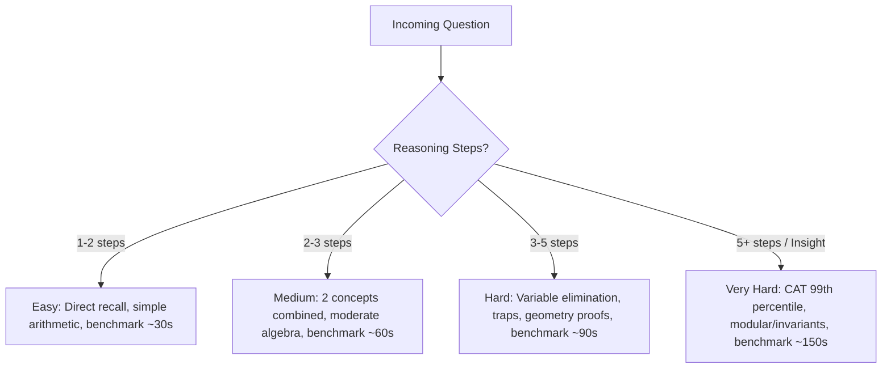

# Ikshvaku Quantitative Aptitude Question Bank

<div align="center">

# 🏛️ Ikshvaku Aptitude Arena
### *“Practice. Think. Compete.”*

[](LICENSE)
[](metadata/question-counts.json)
[](schema/question-schema.json)
[](scripts/detect_duplicates.py)
[](https://github.com/ikshvaku-vidya-academy)

</div>

---

## 📌 Overview

**`ikshvaku-quantitative-aptitude`** is the official, open-source, production-grade **Question Bank** for the **Ikshvaku Aptitude Arena**, an educational platform maintained by **Ikshvaku Vidya Academy**.

> [!IMPORTANT]
> **Data-Only Architectural Scope**:
> This repository is exclusively dedicated to storing, categorizing, validating, indexing, and managing quantitative aptitude questions.
> It deliberately **does NOT contain**:
> - Frontend user interfaces or web applications
> - Exam timers or session state management
> - User authentication or payment gateways
> - Quiz engines or scoring business logic
>
> Downstream consumer applications (e.g., the *Ikshvaku Aptitude Arena* web platform, mobile apps, or mock test engines) ingest this repository as their single source of truth for aptitude questions.

---

## 🏗️ Repository Architecture

The repository is structured to scale cleanly to **500,000+ questions** using chunked hierarchical storage by topic and difficulty:

```
ikshvaku-quantitative-aptitude/
│
├── README.md                           # Master architectural documentation
├── LICENSE                             # MIT License (Ikshvaku Vidya Academy)
├── CONTRIBUTING.md                     # Contributor guidelines and authoring standards
├── .gitignore                          # Standard Python and IDE ignore patterns
│
├── schema/
│   └── question-schema.json            # Formal JSON Schema (Draft-07 compliant)
│
├── metadata/
│   ├── topics.json                     # Complete taxonomy of 17 topics & subtopics
│   ├── difficulty-levels.json          # Ikshvaku Cognitive Difficulty Framework (ICDF)
│   └── question-counts.json            # Machine-readable inventory & metrics
│
├── questions/                          # Partitioned question storage (Topic -> Difficulty)
│   ├── number-system/
│   │   ├── easy/       number-system_easy_001.json
│   │   ├── medium/     number-system_medium_001.json
│   │   ├── hard/       number-system_hard_001.json
│   │   └── very_hard/  number-system_very_hard_001.json
│   ├── percentages/
│   ├── ratio-proportion/
│   ├── averages/
│   ├── profit-loss/
│   ├── simple-compound-interest/
│   ├── time-work/
│   ├── time-speed-distance/
│   ├── mixtures-alligation/
│   ├── partnership/
│   ├── algebra/
│   ├── geometry/
│   ├── mensuration/
│   ├── probability/
│   ├── permutation-combination/
│   ├── data-interpretation/
│   └── miscellaneous/
│
└── scripts/
    ├── validate_questions.py           # 12-point quality control validator
    ├── detect_duplicates.py            # Fuzzy, exact & structural clone detection
    ├── generate_statistics.py          # Dashboard aggregator & metadata updater
    └── exam_engine_loader.py           # Reference Python SDK for consumer engines
```

---

## 📐 Question Schema & Format

Every question conforms to `schema/question-schema.json`.

### Question Data Model

```json
{
  "id": "QA-PERCENTAGE-000001",
  "subject": "quantitative_aptitude",
  "topic": "percentages",
  "subtopic": "percentage_increase",
  "difficulty": "medium",
  "question_type": "single_choice",
  "question": "A student's marks increase from 240 to 300. What is the percentage increase?",
  "options": [
    "20%",
    "25%",
    "30%",
    "35%"
  ],
  "answer": "25%",
  "explanation": "Increase = 300 - 240 = 60. Percentage increase = (60 / 240) × 100 = 25%.",
  "estimated_time_seconds": 30,
  "tags": [
    "percentage",
    "increase",
    "basic-arithmetic"
  ]
}
```

### Required Fields & Constraints

| Field | Type | Description | Conformance Rules |
|---|---|---|---|
| `id` | `string` | Unique question identifier | Regex: `^QA-[A-Z0-9]+-[0-9]{6}$` |
| `subject` | `string` | Academic subject domain | Constant: `"quantitative_aptitude"` |
| `topic` | `string` | Major topic slug | Must match registered slug in `metadata/topics.json` |
| `subtopic` | `string` | Specific subtopic slug | Must match allowed subtopics for the given topic |
| `difficulty` | `string` | Cognitive difficulty | Enum: `["easy", "medium", "hard", "very_hard"]` |
| `question_type` | `string` | Question presentation type | Enum: `["single_choice", "multiple_choice", "numerical", "true_false"]` |
| `question` | `string` | Full problem statement | Minimum 10 characters, unambiguous conditions |
| `options` | `array` | Option choices | 3-6 strings for single/multiple choice; empty for numerical; 2 for true/false |
| `answer` | `string` or `array` | Correct answer key | Must be present in `options` (or string/number for numerical) |
| `explanation` | `string` | Step-by-step solution | Detailed derivation with shortcut rationale (min 10 chars) |
| `estimated_time_seconds` | `integer` | Benchmark solve duration | Positive integer between 10 and 600 seconds |
| `tags` | `array` | Indexing tags | Non-empty array of strings (min 2 chars each) |

---

## 🆔 Question ID System

To guarantee global uniqueness and machine parseability, every question follows the canonical format:

$$\text{QA}-\text{[TOPIC\_CODE]}-\text{[6-DIGIT SERIAL]}$$

### Registered Topic Codes

| Topic Slug | Topic Code | ID Range Example |
|---|---|---|
| `number-system` | `NUMSYS` | `QA-NUMSYS-000001` to `QA-NUMSYS-999999` |
| `percentages` | `PERCENTAGE` | `QA-PERCENTAGE-000001` to `QA-PERCENTAGE-999999` |
| `ratio-proportion` | `RATIOPROP` | `QA-RATIOPROP-000001` to `QA-RATIOPROP-999999` |
| `averages` | `AVERAGES` | `QA-AVERAGES-000001` to `QA-AVERAGES-999999` |
| `profit-loss` | `PROFITLOSS` | `QA-PROFITLOSS-000001` to `QA-PROFITLOSS-999999` |
| `simple-compound-interest` | `SICI` | `QA-SICI-000001` to `QA-SICI-999999` |
| `time-work` | `TIMEWORK` | `QA-TIMEWORK-000001` to `QA-TIMEWORK-999999` |
| `time-speed-distance` | `TSD` | `QA-TSD-000001` to `QA-TSD-999999` |
| `mixtures-alligation` | `MIXALLIG` | `QA-MIXALLIG-000001` to `QA-MIXALLIG-999999` |
| `partnership` | `PARTNER` | `QA-PARTNER-000001` to `QA-PARTNER-999999` |
| `algebra` | `ALGEBRA` | `QA-ALGEBRA-000001` to `QA-ALGEBRA-999999` |
| `geometry` | `GEOMETRY` | `QA-GEOMETRY-000001` to `QA-GEOMETRY-999999` |
| `mensuration` | `MENSUR` | `QA-MENSUR-000001` to `QA-MENSUR-999999` |
| `probability` | `PROB` | `QA-PROB-000001` to `QA-PROB-999999` |
| `permutation-combination` | `PERMCOMB` | `QA-PERMCOMB-000001` to `QA-PERMCOMB-999999` |
| `data-interpretation` | `DI` | `QA-DI-000001` to `QA-DI-999999` |
| `miscellaneous` | `MISC` | `QA-MISC-000001` to `QA-MISC-999999` |

---

## 🎯 Cognitive Difficulty Framework (ICDF)

Questions are never randomly assigned difficulty. Classification follows the **Ikshvaku Cognitive Difficulty Framework**:



### Detailed Rubric (`metadata/difficulty-levels.json`)

1. **Easy** (`target: 15 - 45s`, benchmark: 30s)
   - Direct concept application and standard formula evaluation.
   - Minimal calculation overhead.
   - Straightforward, distinct distractors.

2. **Medium** (`target: 40 - 80s`, benchmark: 60s)
   - Multi-step reasoning combining 2 to 3 concepts.
   - Moderate algebraic modeling (percentages linked to profit, ratios with age).
   - Plausible distractors based on intermediate arithmetic states.

3. **Hard** (`target: 70 - 130s`, benchmark: 90s)
   - Deep conceptual synthesis requiring non-obvious substitution or geometry visualization.
   - Multi-branch conditions or quadratic roots.
   - Trap-prone distractors reflecting cognitive biases and inverted relationships.

4. **Very Hard** (`target: 110 - 240s`, benchmark: 150s)
   - Advanced Olympiad / CAT 99th-percentile calibre.
   - Invariant detection, boundary testing, Diophantine equations, or modular shortcuts.
   - Sophisticated near-miss distractors.

---

## 🚀 Large-Scale Scalability Architecture (500,000+ Questions)

Storing 500,000 questions in a single JSON file causes memory exhaustion, slow git diffing, merge conflicts, and network timeouts. 

This repository implements a **2-Level Partitioned Chunking Strategy**:

$$\text{questions} \longrightarrow \text{topic} \longrightarrow \text{difficulty} \longrightarrow \text{chunk\_file.json}$$

### Partitioning Rules:
- **Chunk Size**: Each chunk file contains an array of **100 to 500 questions** (~150 KB to ~750 KB per file).
- **Naming Pattern**: `<topic>_<difficulty>_<chunk_number>.json` (e.g. `percentages_easy_001.json`, `percentages_easy_002.json`).
- **Concurrent Ingestion**: Multiple authors and automated ingestion pipelines can commit questions to separate topic branches simultaneously without merge conflicts.
- **Lazy Loading**: Exam engines can selectively stream only requested chunk files (e.g. only loading `time-work/hard/` when generating hard time-work questions).

---

## 🛠️ Quality Control & Developer Tooling

This repository includes a standalone, zero-dependency Python toolchain in `scripts/`:

### 1. Question Bank Validator (`validate_questions.py`)

Verifies 12 critical quality dimensions:
1. Missing mandatory schema fields
2. Conformance to difficulty levels
3. Conformance to supported question types
4. Duplicate question IDs across all files
5. Duplicate question text across all files
6. Missing or empty answers
7. Option structure and length validity
8. Exact presence of answer within options (`single_choice` & `true_false`)
9. Non-empty, step-by-step explanations
10. Valid estimated solution time
11. Topic and subtopic registration against `metadata/topics.json`
12. Malformed JSON syntax

```bash
# Run complete validation across the entire question bank
python scripts/validate_questions.py

# Validate a specific file or topic directory
python scripts/validate_questions.py --path questions/percentages/
```

### 2. Duplicate & Structural Clone Detector (`detect_duplicates.py`)

Detects:
- Exact duplicate questions
- Case-insensitive and whitespace-normalized duplicates
- High textual similarity ($> 85\%$) using token Jaccard and sequence matching
- **Structural template clones** (questions with identical grammatical sentences but only changed numbers)

```bash
# Run duplicate audit with default 85% threshold
python scripts/detect_duplicates.py

# Generate audit reports in JSON or Markdown
python scripts/detect_duplicates.py --threshold 0.80 --output-markdown reports/duplicates.md
```

### 3. Statistics Aggregator (`generate_statistics.py`)

Scans all question files, recalculates metrics, prints an ASCII status dashboard, and updates `metadata/question-counts.json`:

```bash
python scripts/generate_statistics.py
```

---

## 🔌 Consuming the Data (Exam Engine Integration)

Downstream applications can easily query, sample, and assemble test papers using our reference loader (`scripts/exam_engine_loader.py`):

```python
from pathlib import Path
from scripts.exam_engine_loader import QuestionBankLoader

# Initialize question bank in memory (O(1) lookups)
loader = QuestionBankLoader()

# Scenario A: Generate a 25-Question Stratified Test Paper
# 10 Easy + 10 Medium + 5 Hard
blueprint = {"easy": 10, "medium": 10, "hard": 5}
test_paper = loader.generate_exam_blueprint(blueprint)

# Scenario B: Topic-Specific Drill (20 Medium Profit & Loss questions)
drill_questions = loader.query(
    topics=["profit-loss"],
    difficulties=["medium"]
)

# Scenario C: Filter by Subtopic and Question Type
custom_set = loader.query(
    topics=["time-speed-distance"],
    subtopics=["trains", "boats_and_streams"],
    difficulties=["medium", "hard"],
    question_types=["single_choice"]
)

# Scenario D: Benchmark Exam Duration
total_time_minutes = sum(q["estimated_time_seconds"] for q in test_paper) / 60
print(f"Calculated Exam Duration: {total_time_minutes:.1f} minutes")
```

---

## 📊 Current Repository Metrics

| Metric | Current Value | Target (v2.0) |
|---|---|---|
| **Total Verified Questions** | **170** | 10,000+ |
| **Major Topics Covered** | **17 / 17 (100%)** | 17 / 17 |
| **Questions per Topic** | 10 high-calibre questions | 500+ |
| **Difficulty Breakdown** | 30% Easy, 40% Medium, 20% Hard, 10% Very Hard | Maintained Ratio |
| **Duplicate Count** | **0 (Zero Clones)** | 0 |
| **Validation Violations** | **0 Errors** | 0 |

---

## 🤝 Contributing

We welcome contributions of high-quality quantitative aptitude questions from educators, curriculum designers, and competitive examination coaches.

Please read our [Contributing Guidelines](CONTRIBUTING.md) before submitting a Pull Request.

---

## 📜 License

This repository is distributed under the **MIT License**. See [LICENSE](LICENSE) for full details.

---

<div align="center">

**Ikshvaku Vidya Academy**  
*Building India's Most Rigorous Aptitude & Cognitive Evaluation Ecosystem.*

</div>
